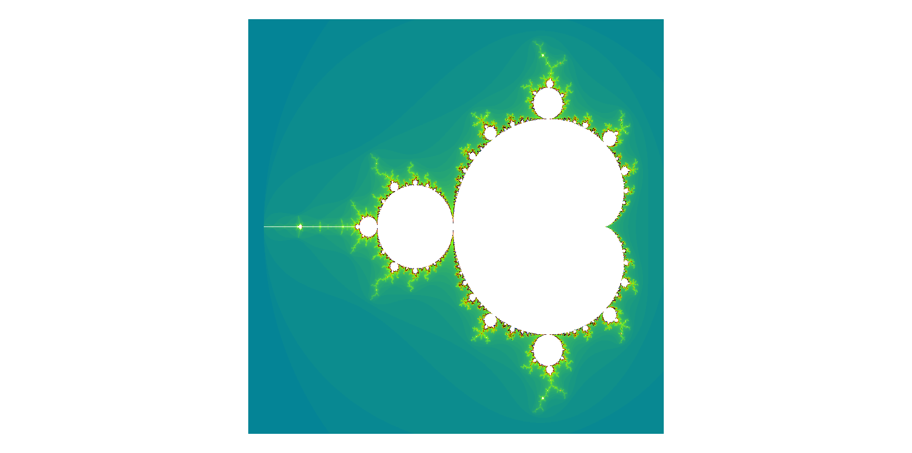

# Trying Out Wasm

## Live Demo

https://t-cadet.github.io/trying-out-wasm/

## Getting Started

### Dependencies

- [gnumake](https://www.gnu.org/software/make/)
- [python3](https://github.com/python/cpython)
- [wabt](https://github.com/WebAssembly/wabt)
- [wasmtime](https://github.com/bytecodealliance/wasmtime)

### Build & Run

```bash
cd fractal
make build
make serve
```

Then open your browser at `http://localhost:8000`

## Resources

- https://awesome.red-badger.com/chriswhealy/introduction-to-web-assembly-text
- https://awesome.red-badger.com/chriswhealy/plotting-fractals-in-webassembly
- https://developer.mozilla.org/en-US/docs/WebAssembly
- https://webassembly.github.io/spec/core/
- https://en.wikipedia.org/wiki/Mandelbrot_set

## Gallery



## Optimizations

- The Mandelbrot shader is vectorized on 128 bits (the max available in Wasm as of Aug 2025)
- The shader also does cardioid and bulb checking to exit early
- The color palette is pre-generated
- The wasm is embedded in the HTML as a base64 string for a fast 1st load

